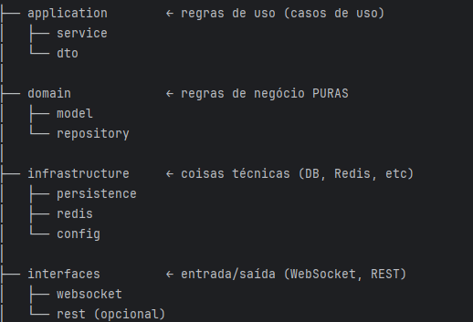

# 💬 WebSocket Chat com Quarkus + Redis

Projeto de chat em tempo real utilizando WebSocket, com suporte a múltiplas instâncias através de Redis (Pub/Sub) e persistência em banco de dados.

---

## 🚀 Tecnologias utilizadas

- Java 21
- Quarkus 3.x
- WebSocket (Jakarta)
- Redis (Pub/Sub)
- PostgreSQL
- Hibernate ORM com Panache
- Jackson (JSON)
- Maven

---

## 🧠 Arquitetura

O projeto segue uma abordagem inspirada em **Clean Architecture**, separando responsabilidades em camadas:



### 🔄 Fluxo da aplicação

1. Cliente envia mensagem via WebSocket
2. `ChatSocket` recebe o evento
3. Mensagem é convertida para DTO
4. `ChatService`:
    - Publica no Redis (broadcast global)
    - Persiste no banco
5. `RedisSubscriber`:
    - Consome mensagem do Redis
    - Faz broadcast para sessões WebSocket

---

## 🌐 Comunicação em tempo real

- WebSocket endpoint:
```shell script
ws://localhost:8080/chat/{room}/{user}
```

- Suporte a múltiplas instâncias via Redis Pub/Sub

---

## 🛠️ Como rodar o projeto

### Pré-requisitos

- Java 21
- Maven
- Docker (opcional, mas recomendado)

---

### 1. Subir dependências (Postgres + Redis)

```bash
docker run -d --name postgres \
  -e POSTGRES_PASSWORD=postgres \
  -p 5432:5432 postgres

docker run -d --name redis \
  -p 6379:6379 redis

```shell script
./mvnw package -Dquarkus.package.jar.type=uber-jar
```

## Rodando a aplicação em modo dev

No terminal, execute o comando:

```shell script
./mvnw quarkus:dev
```

### 🧪 Testando o chat

Abra os arquivos abaixo diretamente no navegador:

- `src/main/resources/META-INF/resources/chat1.html`
- `src/main/resources/META-INF/resources/chat2.html`

Você pode:

- Dar duplo clique no arquivo, ou
- Arrastar o arquivo para o navegador

Depois disso, envie mensagens em ambos para testar o chat em tempo real.


---

## ⚠️ Problemas conhecidos e pontos de atenção

### 🔥 Comunicação e JSON
- [ ] Possibilidade de envio de JSON malformado pelo cliente
- [ ] Falta de validação de payload (campos nulos, vazios ou inválidos)
- [ ] Falta de tratamento robusto para erros de serialização/deserialização

---

### 🧵 Concorrência e execução assíncrona
- [ ] Uso de `CompletableFuture.runAsync()` sem controle de pool de threads
- [ ] Risco de criação excessiva de threads sob carga
- [ ] Possível uso incorreto de threads em contexto reativo (event loop)

---

### 🔌 WebSocket
- [ ] Falta de tratamento global de erros em `@OnMessage`
- [ ] Possibilidade de envio para sessões já fechadas
- [ ] Falta de controle de reconexão do cliente
- [ ] Sessões podem não ser removidas corretamente em cenários de falha

---

### 🧠 Gerenciamento de sessões
- [ ] Possível memory leak se sessões não forem removidas corretamente
- [ ] Estrutura de armazenamento em memória não distribuída (não escala horizontalmente)
- [ ] Broadcast sem tratamento de falhas individuais por sessão

---

### 📡 Redis (Pub/Sub)
- [ ] Redis Pub/Sub não garante persistência (mensagens podem ser perdidas)
- [ ] Canal único (`chat`) pode gerar acoplamento entre salas
- [ ] Falta de retry em falhas de conexão com Redis
- [ ] Falta de tratamento para indisponibilidade do Redis

---

### 💾 Persistência
- [ ] Falta de tratamento de erros ao salvar no banco
- [ ] Possível inconsistência entre envio e persistência (não transacional)
- [ ] Timestamp gerado na aplicação (pode variar entre instâncias)

---

### 🌐 Frontend (HTML de teste)
- [ ] Falta de tratamento de erro no `JSON.parse`
- [ ] Falta de validação de mensagem antes do envio
- [ ] Sem feedback visual de conexão/desconexão
- [ ] Sem reconexão automática do WebSocket

---

### 🔐 Segurança
- [ ] Ausência de autenticação
- [ ] Identidade do usuário baseada apenas na URL
- [ ] Falta de autorização por sala
- [ ] Possibilidade de envio de conteúdo malicioso (ex: XSS)

---

### 🧪 Observabilidade e robustez
- [ ] Logs pouco estruturados
- [ ] Ausência de métricas
- [ ] Falta de health checks
- [ ] Sem mecanismos de resiliência (retry, circuit breaker)


---


## 🚀 Próximos passos e melhorias

### 🧠 Arquitetura
- [ ] Introduzir Use Cases explícitos (ex: `SendMessageUseCase`)
- [ ] Criar abstração para mensageria (ex: `MessageBroker`)
- [ ] Reduzir acoplamento entre service e infraestrutura

---

### ⚡ Escalabilidade
- [ ] Substituir Redis Pub/Sub por Kafka ou outra solução durável
- [ ] Implementar particionamento por sala
- [ ] Garantir ordenação de mensagens
- [ ] Adicionar fila para processamento assíncrono

---

### 💾 Persistência
- [ ] Criar endpoint REST para histórico de mensagens
- [ ] Implementar paginação
- [ ] Ordenação por timestamp
- [ ] Criar índices no banco (roomId, timestamp)

---

### 🔐 Segurança
- [ ] Implementar autenticação com JWT
- [ ] Associar usuário autenticado à sessão WebSocket
- [ ] Implementar autorização por sala
- [ ] Sanitizar mensagens para evitar XSS

---

### 🌐 Frontend
- [ ] Criar interface com React ou Vue
- [ ] Implementar scroll automático
- [ ] Exibir usuários online
- [ ] Indicador de "digitando..."
- [ ] Melhorar experiência visual (UX/UI)

---

### 🔄 WebSocket
- [ ] Implementar reconexão automática
- [ ] Adicionar heartbeat (ping/pong)
- [ ] Controlar sessões duplicadas
- [ ] Limitar conexões por usuário

---

### 🧪 Testes
- [ ] Testes unitários (services e regras de negócio)
- [ ] Testes de integração (WebSocket + Redis)
- [ ] Testes com Testcontainers
- [ ] Testes de carga (simulação de múltiplos usuários)

---

### 📊 Observabilidade
- [ ] Logs estruturados (JSON)
- [ ] Métricas com Micrometer
- [ ] Health checks (banco + Redis)
- [ ] Tracing distribuído (OpenTelemetry)

---

### 🧵 Concorrência
- [ ] Avaliar uso de programação reativa (Mutiny)
- [ ] Avaliar uso de Virtual Threads (Java 21)
- [ ] Implementar controle de backpressure

---

### 🧩 Funcionalidades adicionais
- [ ] Carregar histórico ao entrar na sala
- [ ] Mensagens privadas (direct message)
- [ ] Upload de arquivos
- [ ] Emojis e reações
- [ ] Notificações em tempo real

---

## Creating a native executable

You can create a native executable using:

```shell script
./mvnw package -Dnative
```

Or, if you don't have GraalVM installed, you can run the native executable build in a container using:

```shell script
./mvnw package -Dnative -Dquarkus.native.container-build=true
```

You can then execute your native executable with: `./target/websocket-java-quarkus-app-1.0.0-SNAPSHOT-runner`

If you want to learn more about building native executables, please consult <https://quarkus.io/guides/maven-tooling>.
